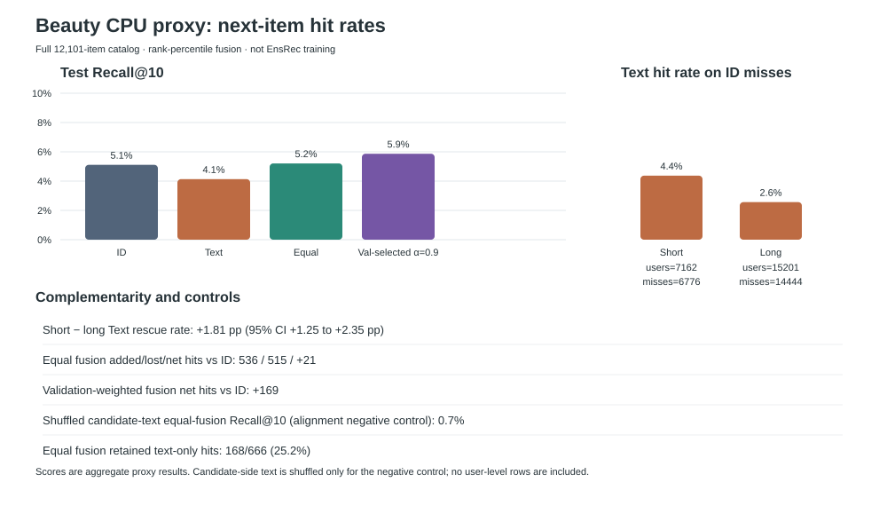

# 用户历史短时，商品文本能补上 ID 推荐漏掉的目标吗？

推荐系统要根据用户已有交互，预测用户下一次会交互的商品。ID 路线利用商品间的行为转移；商品文本提供另一类线索。我的事前预测是：短历史用户的 ID 漏例更容易被 Text 找回。但 Text 单路整体弱于 ID，且独有命中不一定能被融合保留。

## 结果怎样改变判断

在相同 Beauty 测试事件和 12,101 件候选商品上，ID 漏例中 Text 的命中率为：短历史 **296/6,776（4.37%）**，长历史 **370/14,444（2.56%）**；短组高 **1.81 个百分点**（用户 bootstrap 95% 区间 **1.25 至 2.35 个百分点**）。不过，ID 自身 Recall@10 在短组为 **5.39%（386/7,162）**，长组为 **4.98%（757/15,201）**；Text 则从短组 **5.64%** 降到长组 **3.42%**。因此，短组 ID 漏例更常被 Text 找回的预测得到支持，但“历史越长，ID 本身越好”在这次代理测试中并没有成立。

互补也没有自动变成融合收益。Text 命中而 ID 未命中的目标共有 **666 个**，等权融合只保留 **168 个（25.2%）**；它新增 536 次、丢失 515 次，净增仅 21。短组净增 57，长组净减 36。

验证集选出的全局 ID 权重为 **0.9**，前十命中相对 ID 净增 **169 次**，整体 NDCG@10 从 **0.02869** 升到 **0.02995**。但首位命中从 **1.167%** 降到 **0.868%**，长历史组 NDCG@10 从 **0.02820** 降到 **0.02750**。覆盖提高没有让所有排序指标一起提高。首轮测试后追加的分组调权中，两组验证集仍都选出 0.9，没有新增收益。

**全目录主实验**



## 候选规则会改变结果

两项敏感性分析都是看过主实验后的探索；各自在验证集选权重，测试集只报告，不据测试结果挑赢家。

| 规则 | ID → 全局 Recall@10 | 全局净增前十命中 | 其他观察 |
| --- | ---: | ---: | --- |
| 全目录，Text 同分按商品 ID 排序（主实验） | 5.11% → 5.87% | +169 次 | 短减长救回率 +1.81 pp；Hit@1 1.167% → 0.868% |
| 全目录，Text 同分用平均排名 | 5.11% → 5.87% | +169 次 | 融合主命中不变，等权 NDCG@10 仅微变；Text 单路最终仍按商品 ID 拆同分，救回率不构成独立敏感性证据 |
| 所有方法统一排除可见历史商品 | 5.78% → 7.28% | +335 次 | 短减长救回率 +1.91 pp；Hit@1 1.780% → 2.070% |

排除可见历史商品后，测试仍保留全部 22,363 个目标（没有目标与可见历史重复），但每条测试查询候选数降为 12,082–12,097；全局 Recall@10、NDCG@10 和 Hit@1 都高于该策略下的 ID。这个规则改变了候选资格与排序分母，不能和全目录主实验当成同一任务结果。两种候选规则下，分组验证调权仍与全局权重相同；按历史长度分组没有额外收益。完整结果见[策略敏感性说明](docs/beauty-policy-sensitivity.md)。

## 还要怎样解释短长差异

目标商品按训练频次分低、中、高组后，短组的 Text 救回率仍分别高 **2.61、2.38、1.21 个百分点**。粗频次构成不能单独解释差异；这些频次分组只用于测试后诊断，没有用于路由或选择权重，ID 分数中的训练流行度回退仍照常使用。

本次测试的“短历史组”实际全是 **4 件可见历史**，不是泛指 0–4 件。Text 的前十中平均有 **3.672 个短组位置**、**4.637 个长组位置**被已看过商品占据，而目标在完整既往历史中均未出现。旧商品可能挤占新目标的位置；这是事后观察到的候选竞争解释，不能证明它解释了全部差异。[补充排序与分组诊断](docs/beauty-followup-diagnostics.md)和[历史商品占位诊断](docs/seen-item-diagnostic.md)列出完整口径。

## 怎样得到这些结果

这是 Beauty 上的 CPU 代理：ID 分数由训练序列中的商品转移与流行度回退构成；Text 分数由商品目录描述的 TF-IDF 构成。每条查询在共同候选集上排序；两路分数分别转为候选百分位，再比较单路和融合。序列商品 ID `i` 对应目录 ID `i+1`。初轮方法在看测试前已有书面方案，但不是预注册；测试后追加的权重与候选敏感性分析均明确作为探索。这不是 EnsRec 学习表征训练，也没有复现论文的 cosine 融合。

按 [EnsRec 上游 README 的 Data Preparation 说明](https://github.com/snap-research/EnsRec#data-preparation)准备 Beauty 数据目录，其中包含 `items/`、`training/`、`evaluation/` 和 `testing/` TFRecord 文件。原始数据、用户序列和商品文本不放入本仓库。安装依赖后运行主实验：

```bash
python -m pip install -r requirements-proxy.txt
python scripts/beauty_cpu_proxy.py \
  --data-dir /path/to/EnsRec/data/beauty \
  --output-dir outputs/beauty-cpu-proxy
```

需要逐事件本地复核时可加 `--write-event-diagnostics`；明细默认关闭且不应提交。

两项敏感性分析使用独立输出目录，保留主实验结果：

```bash
python scripts/beauty_cpu_proxy.py --data-dir /path/to/EnsRec/data/beauty \
  --output-dir outputs/beauty-average-ties --text-tie-policy average
python scripts/beauty_cpu_proxy.py --data-dir /path/to/EnsRec/data/beauty \
  --output-dir outputs/beauty-exclude-seen --exclude-visible-history
```

完整结果与口径见[策略敏感性说明](docs/beauty-policy-sensitivity.md)。

## 相关材料

- [研究案例走读](docs/research-case-walkthrough.md)：从问题、反例到下一步决策
- [轻量探测计划](docs/lightweight-probe-plan.md)：指标口径、方法、分层结果和替代解释
- [原始方案与证据边界](docs/protocol.md)：真实 EnsRec 计划与已完成代理实验的区别
- [配置审计](docs/config-audit.md)：我发现 Text 负样本消融配置改了 ID 分支的 loss 开关，Text 分支仍走 full-batch loss；建议改为 Text 专属开关与 in-batch loss 的 patch 见[此处](patches/text-negative-ablation.patch)
- [主实验聚合结果](results/beauty-cpu-proxy-results.json)、[平均同分排名结果](results/beauty-cpu-proxy-average-ties-results.json)、[排除可见历史商品结果](results/beauty-cpu-proxy-unseen-candidates-results.json)
- [代理脚本](scripts/beauty_cpu_proxy.py)
